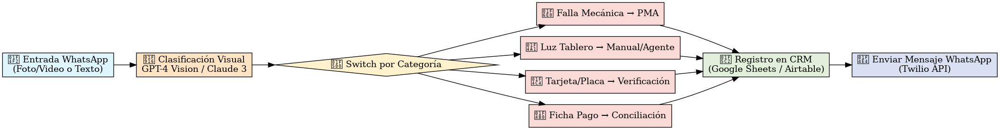

# CORE FASE 2B: UX, WIREFRAMES Y FLOWS

> Fuentes: `Prompts - Wireframes - DeepSeek.docx`, `Visily-Export_26-06-2025_07-31.pdf`, `FlowiseAI_UX_Postventa.png`, archivos PWA (cotizador, protección, CRM).

---

## 🎯 Objetivo

Documentar la experiencia de usuario para asesores, operadores y administradores, incluyendo prompts de diseño, wireframes y conexiones con IA/postventa para asegurar una implementación consistente entre PWA, backend y Odoo.

### Fuentes sincronizadas (17-dic-2025)

- `PWA - ANGULAR TERCERA VUELTA.docx` → navegabilidad quirúrgica y componentes Angular.
- `DemoPWA.docx` → demo ejecutable en HTML/JS para entrenamiento.
- `FlowiseAI_UX_Postventa.png` y `Visily-Export_26-06-2025_07-31.pdf` ahora viven en `assets/wireframes/` dentro del repositorio.
- `ANEXO_PWA_IMPLEMENTACION.md` centraliza referencias cruzadas HU ↔ UI ↔ servicios.

---

## 1. Componentes Prioritarios

| Prioridad | Vista / Flujo | Descripción | Fuente |
|-----------|---------------|-------------|--------|
| ⚡ Máxima | **Dashboard Operador** | Super-app móvil con saldo pendiente, próximo pago, ahorro GNV, mapa de ruta y activación rápida de Protección Rodando. Menú inferior: Pagos / Protección / Mi Unidad / Soporte. Gamificación con “Puntos RAG”. | Prompts DeepSeek + Visily export |
| 🔥 Crítica | **Activación Protección Rodando** | Secuencia 3 pantallas: alerta push/WhatsApp, confirmación con nuevo plan, gráfico TIR ajustado y mensaje “unidad sigue protegida”. | Prompts DeepSeek |
| ⚠️ Alta | **Panel Admin RAG** | Dashboard desktop con mapa de calor de morosidad por rutas, widgets TIR cartera, % uso protección, alertas HASE y filtros. | Prompts DeepSeek |
| ✨ Alta | **Onboarding Digital** | Flujo 4 pasos (SMS, upload docs INE/Carta ruta, simulador ahorro GNV vs gasolina, firma digital + WhatsApp). | Prompts DeepSeek |
| 💰 Media | **Marketplace Servicios** | “Tienda RAG” con seguros, mantenimientos, recarga GNV. Recomendaciones y promo de tandas. | Prompts DeepSeek |
| 🎮 Media | **Gamificación** | Avatar conductor, progress bar, logros (“Rey GNV”), leaderboard por ruta. | Prompts DeepSeek |

Detalles de cada prompt están en `Prompts - Wireframes - DeepSeek.docx` (ver tabla en el documento) y se usaron para generar los wireframes en Visily.

---

## 2. Wireframes (Visily)

### 2.1 Export `Visily-Export_26-06-2025_07-31.pdf`

Contiene mockups de:
- Dashboard operador (movil)
- Activación Protección Rodando (multimedia)
- Panel admin RAG
- Simulador/Onboarding con comparativa GNV vs gasolina
- Marketplace/Store con upsells
- Gamification leaderboard

**Assets:**
- [PDF Visily (download)](../assets/wireframes/Visily-Export_26-06-2025_07-31.pdf)
- Vista clave Flowise/IA:

### 2.2 Flujo IA postventa (`FlowiseAI_UX_Postventa.png`)

Imagen (2111×275 px) con el pipeline del agente RAG (WhatsApp → Twilio → Make → Flowise/OpenAI → Pinecone → respuesta/ticket). Se relaciona con `IDEAS_18_AGENTE_POSTVENTA_RAG.md` (sección de arquitectura). Conviene mover esta imagen a `/assets` y referenciarla en IDEAS/Anexo postventa.

---

## 3. Integración con PWA y Odoo

- Las vistas descritas se corresponden con componentes Angular (`CollectiveCredit`, `Cotizador`, `Document Center`, etc.). Ver `PWA - HU.docx` y `Blueprint Definitivo...` para correspondencia UI↔HU (ej. HU03 Cockpit, HU07 configurador, HU10/11 pagos híbridos).
- Datos maestros (paquetes, cuentas analíticas, rutas) provienen de Odoo (ver `ANEXO_ODOO_SETUP.md`).
- El panel admin RAG consolida métricas del core bancario (FASE9) y HASE/Voice Pattern (LOGICA Sección 2/6).
- Onboarding y upload documental se conectan con Metamap/Mifiel/Conekta (FASE4 integraciones).

---

## 4. Roadmap UX

1. **Estandarizar prompts** (DeepSeek) → replicarlos en Figma/Visily con branding final.
2. **Capturar assets**: export PNG/JPG para cada vista y alojar en `/wireframes`.
3. **Crear prototipos interactivos** (Visily/Figma) para capacitación asesores.
4. **Sincronizar con PWA**: verificar que componentes Angular reflejen los flujos aquí descritos (huellas UI ↔ código). Documentar diferencias en `PWA - HU.docx` y migrarlas a este anexo.
5. **Conectar a IA**: Ensure flow diagrams (Flowise) estén linkeados a IDEAS_18 y `ANEXO_POSTVENTA_HIGER.md`.
6. **Actualizar auditoría**: marcar gap “Wireframes/Flujos UX” como en proceso a medida que se suban los assets.

---

## 5. Pendientes

- ✅ Wireframes (Visily) + Flowise export alojados en `assets/wireframes/`.
- ✅ Contenido de `PWA - ANGULAR TERCERA VUELTA.docx` y `DemoPWA.docx` integrado en las secciones 6 y 7.
- Pendiente: añadir capturas con datos reales del Panel Admin RAG y Dashboard operador una vez que NEON/Odoo expongan métricas definitivas.

Con este anexo se cubre el gap de wireframes/UX identificado en la auditoría. Falta completar los assets visuales y alinear el código Angular con el diseño final.

---

## 6. Flujo guiado Angular ("Tercera Vuelta")

> Fuente directa: `PWA - ANGULAR TERCERA VUELTA.docx` (dump 17-dic-2025).

### 6.1 Pilares de navegación

| Pilar | Descripción quirúrgica | Componentes |
|-------|------------------------|-------------|
| **Barra lateral adaptativa** | Estado colapsado/expandido con badges de tareas pendientes; agrupa módulos por flujo (Prospección, Operación, Aftermarket). | `SidebarComponent`, `NavBadge`, `ModuleGroup` |
| **Header contextual** | Botón `+ Nueva Oportunidad` obliga a abrir `SimulatorLanding` y ata cada simulación a un lead; muestra estado de integraciones. | `Header.tsx`, `ActionButtons`, `IntegrationsStatus` |
| **Menú inferior móvil** | Cuatro accesos directos (Pagos, Protección, Mi Unidad, Soporte) sincronizados con los KPIs del operador. | `BottomNav`, `QuickActionsComponent` |
| **Alertas y gamificación** | “Puntos RAG”, badges de puntualidad y estados `At Risk / On Track` visibles en tarjetas y en el cockpit. | `GamificationBadge`, `AlertTimeline` |

### 6.2 Módulos críticos

- **Dashboard operador (`DashboardOperator`):** tarjetas con saldo pendiente, próximo pago, ahorro GNV y CTA “Activar Protección”; incluye mapa de ruta y ranking de rutas.
- **Activación Protección Rodando (`ProtectionFlow`):** Secuencia A) alerta push, B) confirmación con plan recalculado, C) mensaje “unidad sigue protegida”.
- **Panel Admin RAG (`AdminRagPanel`):** heatmap morosidad por ruta, widgets TIR cartera, % uso protección, alertas HASE; alimentado por NEON → Metabase.
- **Onboarding digital (`OnboardingFlow`):** 4 pantallas (SMS, upload docs, simulador ahorro, firma digital). El paso 3 conecta al comparador GNV vs gasolina.
- **Simulator/Cotizador (`SimulatorLanding`, `Cotizador`):** modos `Camaleón` (oferta), `SavingsProjectionChart`, `RemainderBar`, `TandaTimeline`. El botón “Formalizar” redirige a `ClientDetail` con el expediente dinámico.
- **Grupos Colectivos (`CollectiveCredit`):** constructor de eventos “what-if” y línea de tiempo mensual para la bola de nieve de aportaciones.

Todas las rutas están descritas en `ANEXO_PWA_IMPLEMENTACION.md` y ligadas a las HU equivalentes.

---

## 7. DemoPWA interactiva

> Fuente directa: `DemoPWA.docx` (HTML demo incluida en el doc).

- **Router hash:** `#/login`, `#/asesor/dashboard`, `#/asesor/lead/{id}`, `#/cliente/{token}`. Permite abrir simultáneamente la vista de asesor y cliente.
- **Persistencia:** `localStorage` (`cd_leads_v1`) para leads, tokens y estados (captura, KYC, aprobado, contrato firmado, pago enganche).
- **Panel rápido:** muestra ruta actual, enlaces de impresión/pruebas y estados de integraciones simulados.
- **Flujos incluidos:** creación de lead, subida simulada de documentos, ejecución de KYC (`startKyc → approved/manual/rejected`), formalización de crédito y seguimiento de etapas.
- **Modo pruebas (`runTests`):** dispara aserciones básicas sobre rutas, creación de tokens, actualización de etapas y limpieza de datos.

**Uso recomendado:**
1. Abrir `index.html` de la demo (desde el doc) en dos pestañas.
2. Iniciar sesión como asesor y generar un lead con token.
3. Abrir la segunda pestaña como cliente con el token para recorrer el onboarding.
4. Verificar en el dashboard del asesor cómo cambian las etapas y alertas en tiempo real.

La demo es la referencia rápida para equipo comercial/capacitación mientras los servicios reales (BFF + Odoo) se estabilizan.
