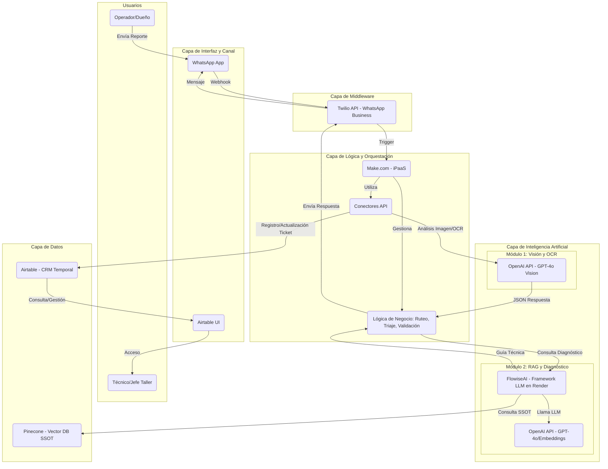

# IDEAS 18: AGENTE DE POSTVENTA RAG (MVP HIGER 17)

**Playbook MVP Higer 17** - Asistente Inteligente de Postventa con RAG (No-Code)

---

## 🎯 VISIÓN GENERAL

Sistema de asistencia técnica automatizado para postventa de autobuses Higer que utiliza:
- **WhatsApp** como interfaz principal
- **RAG (Retrieval-Augmented Generation)** para consultar manuales técnicos
- **GPT-4o Vision** para análisis de imágenes y OCR (VIN, kilometraje)
- **Stack No-Code** para implementación rápida (MVP en 4-6 semanas)

---

## 🏗️ ARQUITECTURA TÉCNICA

### Stack Tecnológico Completo

```yaml
Frontend:
  - WhatsApp App (interfaz operador)
  - Airtable UI (interfaz equipo taller)

Middleware:
  - Twilio API (WhatsApp Business)

Backend:
  - Make.com (orquestación iPaaS)

AI/ML Modules:
  - OpenAI GPT-4o Vision (OCR, triaje, análisis visual)
  - FlowiseAI (framework RAG, desplegado en Render)
  - OpenAI Embeddings (vectorización de manuales)

Databases:
  - Airtable (CRM temporal, registro de tickets)
  - Pinecone (Vector DB para SSOT de manuales)
```

### Diagrama de Arquitectura



---

## 💰 COSTOS ESTIMADOS (MENSUAL)

| Servicio | Costo Mensual | Propósito |
|----------|---------------|-----------|
| **OpenAI API** | $50-100 USD | GPT-4o (visión + RAG) |
| **Twilio WhatsApp** | Variable | Por mensaje/conversación |
| **Make.com** | $16-30 USD | Orquestación (plan Core/Pro) |
| **Airtable** | $0 USD | Plan gratuito (CRM temporal) |
| **Pinecone** | $0 USD | Plan Starter (Vector DB) |
| **Render (Flowise)** | $7 USD | Hosting FlowiseAI |
| **TOTAL** | **$73-137 USD** | MVP completo |

---

## 📋 FASE 0: CONFIGURACIÓN DEL TALLER (SEMANA 1)

### 1. OpenAI (El Motor IA)

**Setup:**
1. Ve a [platform.openai.com](https://platform.openai.com)
2. Configura facturación (Pay-as-you-go)
3. Genera una API Key
4. Modelo recomendado: **GPT-4o** (mejor para visión + razonamiento + costo)

**Costo:** $50-100 USD/mes (depende del volumen de reportes)

---

### 2. Twilio (El Canal WhatsApp)

**Setup:**
1. Crea una cuenta en [Twilio](https://www.twilio.com)
2. Compra un número
3. **CRÍTICO:** Inicia el proceso de aprobación de **WhatsApp Business API (WABA)** YA (puede tardar días)
4. Usa el **"WhatsApp Sandbox"** de Twilio para empezar a probar hoy mismo

**Costo:** Variable por mensaje/conversación

---

### 3. Make.com (El Orquestador)

**Setup:**
1. Regístrate en [Make.com](https://www.make.com)
2. Necesitarás el plan **"Core"** o **"Pro"**

**Costo:** $16-30 USD/mes

---

### 4. Airtable (El CRM Temporal)

**Setup:**
1. Regístrate en [Airtable](https://airtable.com)
2. Plan gratuito suficiente para MVP

**Costo:** $0

---

### 5. Pinecone (La Memoria Vectorial para RAG)

**Setup:**
1. Regístrate en [Pinecone.io](https://www.pinecone.io)
2. Usa el plan **"Starter"** (gratuito)

**Costo:** $0

---

### 6. FlowiseAI (El Framework de IA Visual)

**Setup:**
1. FlowiseAI es el software para construir el RAG
2. Necesita estar alojado online
3. **Despliegue No-Code:** Usa [Render.com](https://render.com)
4. Sigue la guía oficial: [Deploy Flowise on Render](https://docs.flowiseai.com/deployment/render)
5. Es casi un solo clic

**Costo:** $7 USD/mes (Plan Básico de Render)

---

## 📚 FASE 1: CREACIÓN DEL SSOT (RAG) - LA MEMORIA TÉCNICA (SEMANA 1)

Vamos a enseñarle a la IA los manuales de Higer (el **Single Source of Truth**).

### Paso 1.1: Preparar los Manuales

Ten listos los **manuales técnicos de Higer en PDF** (asegúrate que el texto sea seleccionable, no imágenes escaneadas).

---

### Paso 1.2: Configurar la Base de Datos Vectorial (Pinecone)

1. En Pinecone, haz clic en **"Create Index"**
2. Configuración:
   ```yaml
   Nombre: higer-ssot
   Dimensions: 1536  # CRUCIAL: Tamaño que usa OpenAI para embeddings
   Metric: cosine
   Plan: Starter
   ```
3. Ve a **"API Keys"** y copia:
   - API Key
   - Environment (ej. `gcp-starter`)

---

### Paso 1.3: Ingesta de Datos en Flowise (Subir los Manuales)

**En tu instancia de Flowise (desplegada en Render):**

1. Crea un flujo temporal: **"Ingesta Manuales"**
2. Añade y conecta los siguientes nodos (arrastrar y soltar):

```
PDF File (Document Loaders)
    ↓
Recursive Character Text Splitter (Text Splitters)
    Config: Chunk Size: 1000, Chunk Overlap: 200
    ↓
OpenAI Embeddings (Embeddings)
    Config: Introduce tu API Key de OpenAI
    ↓
Pinecone Upsert Document (Vector Stores)
    Config: Introduce tus credenciales de Pinecone
```

3. **Ejecutar:**
   - Sube el PDF en el nodo **PDF File**
   - Guarda el flujo
   - Haz clic en el botón de **"Chat"** o **"Upsert"** para procesar

**¡Tus manuales están indexados!**

---

## 🗄️ FASE 2: CONFIGURACIÓN DE LA BASE DE DATOS (AIRTABLE) (SEMANA 1)

### Crear la Base Higer_Postventa

1. En Airtable, crea una nueva **Base** llamada `Higer_Postventa`
2. Nombra la tabla: `Tickets_Servicio`
3. Crea las siguientes columnas:

| Columna | Tipo | Descripción |
|---------|------|-------------|
| `TicketID` | Autonumber | ID único del ticket |
| `Fecha` | Created Time | Fecha de creación automática |
| `Telefono` | Phone | Teléfono del operador |
| `Sintomas_Operador` | Long text | Descripción del problema (texto del operador) |
| `VIN` | Single line text | VIN extraído de la imagen |
| `Kilometraje` | Number | Kilometraje extraído del tablero |
| `Diagnostico_Vision` | Long text | Diagnóstico generado por GPT-4o Vision |
| `Severidad` | Single select | Opciones: Baja, Media, Alta, Crítica |
| `Guia_RAG` | Long text | Procedimiento extraído del manual (RAG) |
| `Adjuntos` | Attachment | Fotos subidas por el operador |

---

## 🧠 FASE 3: CONSTRUCCIÓN DEL CEREBRO Y LA ORQUESTACIÓN (SEMANAS 2-4)

### Arquitectura Híbrida Simplificada

- **Make + OpenAI Vision:** Para OCR (VIN/KM) y análisis visual
- **Flowise + RAG:** Para consultar los manuales técnicos

---

## PARTE A: EL CEREBRO RAG (FLOWISE)

### Paso 3.1: Crear el Flujo de Consulta RAG

1. En Flowise, crea un nuevo flujo: **"Consulta_Higer_RAG"**
2. Añade y conecta los siguientes nodos:

```
Chat OpenAI
    Config:
    - Model: GPT-4o
    - Temperature: 0.1 (para precisión)
    ↓
OpenAI Embeddings
    ↓
Pinecone Load Existing Index
    Config: Mismas credenciales, index: higer-ssot
    ↓
Retrieval QA Chain (nodo principal)
    Conecta: Chat Model + Pinecone Index (como Vector Store Retriever)
```

3. **Configurar el Prompt:**

En el **Retrieval QA Chain** o en el **Chat OpenAI (System Message)**, define:

```
Eres un asistente técnico experto en Higer.
Usa ÚNICAMENTE el contexto proporcionado de los manuales técnicos para responder la consulta.

La consulta contiene síntomas de falla. Tu tarea es encontrar los pasos de revisión
o solución exactos en el manual.

Responde con instrucciones claras y concisas.
Si no está en el manual, responde "Procedimiento no encontrado en SSOT".
```

4. **Exponer la API:**
   - Guarda el flujo
   - Haz clic en el botón `</>` (API Endpoint)
   - Copia la **URL de la API**

---

## PARTE B: LA ORQUESTACIÓN (MAKE)

Este es el **flujo principal** que conecta WhatsApp con la IA.

### Paso 3.2: Configurar el Trigger de WhatsApp

1. En Make, crea un nuevo **Escenario**
2. **Módulo 1:** Busca `Webhooks` → `Custom Webhook`
3. Créalo y **copia la URL** que te da Make
4. Ve a **Twilio**, en la configuración de WhatsApp (Sandbox o tu número oficial), pega esta URL en el campo **"WHEN A MESSAGE COMES IN"**

---

### Paso 3.3: Manejo de Imágenes (Descarga)

1. Añade un **Router** después del Webhook
2. **Filtro de Imagen:** Crea una ruta que verifique si `MediaUrl0` (el campo de imagen que envía Twilio) existe
3. En la ruta de imagen, añade el módulo `HTTP` → `Get a file`
   - URL: Usa `MediaUrl0` como la URL
   - Esto descarga la imagen para procesarla

*(Si no hay imagen, la otra ruta del router puede responder pidiendo una foto o procesar solo texto)*

---

### Paso 3.4: Visión, OCR y Triaje (Make + OpenAI)

**Aquí extraemos VIN, Kilometraje y determinamos la severidad.**

1. Después de `Get a file`, añade el módulo `OpenAI (DALL-E, GPT)` → `Analyze Image (Vision)`
2. Configuración:
   - Conecta tu API de OpenAI
   - **Model:** GPT-4o
   - **Image File:** Selecciona la imagen descargada del módulo HTTP anterior
3. **Prompt (CRÍTICO):** Este prompt debe hacer todo el análisis y devolver JSON.

```
Eres un sistema de triaje automotriz Higer. Analiza la imagen y el texto del operador.

TEXTO OPERADOR: [Mapea aquí el campo 'Body' del Webhook de Twilio]

Realiza las siguientes tareas:

1. IDENTIFICACIÓN (OCR):
   - Busca una placa VIN y extrae el VIN
   - Busca un tablero y extrae el Kilometraje (Odómetro)

2. DIAGNÓSTICO VISUAL:
   - Describe cualquier falla, daño, fuga o luz de advertencia visible
   - Correlaciona con el texto del operador

3. SEVERIDAD:
   - Clasifica la urgencia general como: BAJA, MEDIA, ALTA, CRITICA

Responde ÚNICAMENTE en formato JSON válido:

{
  "VIN": "[EXTRAIDO o null]",
  "KM": [NUMERO EXTRAIDO o null],
  "DiagnosticoVisual": "[Descripción detallada de la falla y síntomas]",
  "Severidad": "[BAJA/MEDIA/ALTA/CRITICA]"
}
```

---

### Paso 3.5: Procesar la Respuesta de Visión

1. Añade el módulo `JSON` → `Parse JSON`
2. **JSON String:** Mapea la respuesta del módulo OpenAI (usualmente en `Choices[]: Message Content`)
3. **Tip:** Ejecuta el flujo una vez con una imagen de prueba para que Make vea la estructura del JSON

---

### Paso 3.6: Consultar el Manual (Make → Flowise RAG)

Ahora usamos el diagnóstico visual para obtener la guía del manual desde Flowise.

1. Añade el módulo `HTTP` → `Make a Request`
2. Configuración:
   ```yaml
   URL: [Pega la URL de la API de Flowise del Paso 3.1]
   Method: POST
   Body type: Raw
   Content type: JSON
   ```
3. **Request content:**
   ```json
   {
     "question": "Proporciona el procedimiento para estos síntomas: [Mapea DiagnosticoVisual del módulo Parse JSON]"
   }
   ```
4. Marca **"Parse response"**

---

### Paso 3.7: Lógica de Negocio (El Router de Severidad)

1. Añade un **Router**
2. **Ruta A (Alta/Crítica):**
   - **Filtro:** `Severidad` (del JSON Parseado) es igual a `ALTA` O `CRITICA`
   - **Módulo Twilio** → `Send a Message`:
     ```
     ⚠️ ALERTA: Falla [Severidad].
     Diagnóstico: [DiagnosticoVisual].
     Dirígete al taller inmediatamente.
     Notificando al equipo.
     ```
   - **Módulo Email o Slack:** Envía alerta URGENTE al jefe de taller
3. **Ruta B (Baja/Media):**
   - **Filtro:** `Severidad` es igual a `BAJA` O `MEDIA`
   - **Módulo Twilio** → `Send a Message`:
     ```
     ✅ Diagnóstico: [DiagnosticoVisual].
     Severidad: [Severidad].
     Intenta lo siguiente según el manual:
     [Mapea la respuesta de Flowise RAG del Paso 3.6].
     ```

---

### Paso 3.8: Registro en CRM (Airtable)

1. Al final de **ambas rutas** (A y B), añade el módulo `Airtable` → `Create a Record`
2. **Mapea todos los campos:**
   - `Telefono` y `Sintomas_Operador` (del Webhook)
   - `VIN`, `KM`, `DiagnosticoVisual`, `Severidad` (del Parse JSON)
   - `Guia_RAG` (de Flowise)
   - Sube la imagen descargada al campo `Adjuntos`

---

## 🧪 FASE 4: PRUEBAS Y LANZAMIENTO (SEMANAS 5-6)

### Paso 4.1: Pruebas Iterativas

**1. Prueba de OCR/Visión (CLAVE):**
- Usa las fotos reales que tienes (VIN sucio, tablero con reflejos)
- ¿El Paso 3.4 extrae bien el VIN/KM?
- ¿El JSON es válido?
- **Si no:** Ajusta el Prompt del Paso 3.4
- **Este es el paso más sensible**

**2. Prueba de RAG:**
- Prueba el flujo de Flowise (Paso 3.1) directamente
- ¿Responde usando el manual?
- ¿Las referencias son correctas?

**3. Pruebas End-to-End:**
- Activa el escenario en Make
- Envía reportes reales por WhatsApp
- Verifica el flujo completo hasta Airtable

---

## 🔧 EXPLICACIÓN DE NODOS FLOWISE

### Resumen Visual del Flujo RAG

```
PDF File → Text Splitter → Embeddings → Pinecone (index)
                                             ↑
IfElse (imagen/texto) → Custom Retriever ← (consulta usuario)
                           ↓
                    ChatOllama u OpenAI (toman contexto del Retriever)
                           ↓
              [Structured Output Parser/Output Node]
                           ↓
                    Integraciones externas
```

---

### 1. PDF File

**Función:** Nodo de entrada para subir los manuales técnicos de Higer en PDF

**Importancia:** Aquí cargas el conocimiento base del sistema (SSOT). El contenido de estos PDFs será procesado y referenciado en todas las respuestas.

---

### 2. Recursive Character Text Splitter

**Función:** Divide los PDFs en chunks (fragmentos) manejables

**Config:**
- Chunk Size: 1000 caracteres
- Overlap: 200 caracteres

**Importancia:** Esencial para el RAG: fragmenta la información para que los modelos de búsqueda semántica puedan encontrar respuestas precisas y evitar respuestas demasiado largas o genéricas.

---

### 3. OpenAI Embeddings | Ollama Embeddings

**Función:** Convierte cada chunk de texto en vectores numéricos ("embeddings")

**Opciones:**
- **OpenAI** (cloud)
- **Ollama** (modelo local)

**Importancia:** Los embeddings transforman el texto en un formato que permite calcular similitud semántica frente a preguntas futuras.

---

### 4. Pinecone

**Función:** Guarda los embeddings de los manuales como una base vectorial indexada

**Importancia:** Actúa como memoria técnica (vector DB); permite a los "Retrievers" encontrar rápidamente el trozo/chunk más relevante del manual cuando se hace una consulta.

---

### 5. IfElse Function

**Función:** Ramifica el flujo según si el input contiene imagen

**Código:**
```javascript
if (input.image_url && input.image_url.length > 0) {
    return true;
} else {
    return false;
}
```

**Importancia:** Optimiza costos y recursos:
- Usa modelo de nube solo para imágenes/fallas complejas
- Para texto puro, usa versión local para velocidad y bajo costo

---

### 6. Custom Retriever

**Función:** Toma la consulta (texto, síntoma, diagnóstico) y busca en Pinecone los chunks más relevantes

**Importancia:** Recupera el contexto necesario del manual técnico, anclando todas las respuestas del LLM en el conocimiento indexado SSOT.

**⇒ Es el corazón del mecanismo RAG (Retrieval-Augmented Generation)**

---

### 7. LLM (ChatOllama y/o OpenAI)

**Función:** Genera la respuesta final

**Opciones:**
- **ChatOllama:** Modelo local (para consultas simples/baratas)
- **OpenAI (gpt-3.5 turbo o GPT-4o):** Modelo en la nube (más poderoso, para complejidad o imágenes)

**Importancia:** El LLM usa como contexto el output del Custom Retriever (es decir, responde SOLO fundamentando en los manuales). El prompt debe exigir que se limite a información hallada en el contexto recibido.

---

### 8. Structured Output Parser / Output Node (Recomendado)

**Función:** Transforma la salida del LLM en un JSON limpio, estandariza llaves/campos y prepara la respuesta para sistemas externos (Make, WhatsApp, Airtable)

**Importancia:** Da robustez, previene salidas "libres" o no estructuradas, y facilita la integración downstream.

---

## 🎯 PROMPT ENGINEERING PARA RAG TÉCNICO

### Prompt Recomendado (Español - System Message)

```
Eres un asistente técnico experto en autobuses Higer.

Tienes acceso SOLO al siguiente contexto extraído de los manuales técnicos oficiales
(puede estar en español o inglés). Usa exclusivamente este contexto para responder la
consulta del usuario.

1. Fundamenta tu respuesta mencionando los pasos o fragmentos relevantes que estén en el contexto.
2. Si la información que te solicita NO está explícitamente en el contexto, responde:
   "Procedimiento no encontrado en SSOT."
3. Responde con instrucciones claras, precisas y orientadas a diagnóstico técnico y
   solución de fallas para el operador o el técnico de taller.
4. Si el contexto menciona páginas o secciones, cítalas en la respuesta.

---

**Ejemplo de input recibido:**
Consulta del usuario: {{question}}
Fragmentos relevantes del manual: {{context}}

---

REGLAS:
- No inventes ni agregues información fuera del contexto.
- Si el contexto contiene pasos o instrucciones incompatibles, responde solo lo que esté textual.
- Antes de cada paso, indica la fuente (ejemplo: [Manual 2023, pág 48]).
```

---

### Prompt para JSON Estructurado (Respuesta Exportable)

```
Eres un asistente RAG para postventa de autobuses Higer. Usa SOLO el contexto recibido para responder.

Responde SÓLO en el siguiente formato JSON:
{
  "diagnostico": "[Diagnóstico técnico detallado en máximo 3 frases]",
  "pasos": [
    "Paso 1 textual del manual...",
    "Paso 2 textual del manual..."
  ],
  "referencias": [
    "Manual Higer 2022, pág 13",
    "SSOT chunk id: 423"
  ]
}

REGLAS:
- No rellenes con información genérica fuera del contexto.
- Si no hay pasos, deja el array de pasos vacío y en 'diagnostico' pon:
  "Procedimiento no encontrado en SSOT."
```

---

### Tips para Prompts en Flowise

1. **Siempre comienza exigiendo:** "Usa SOLO el contexto proporcionado"
2. **Explica cómo debe citar referencias:** número de página/chunk
3. **Especifica el formato:** texto libre vs. JSON estructurado
4. **Repite la instrucción de "no inventar"** para reducir "alucinaciones"

---

## 📊 COMPARACIÓN: MVP NO-CODE VS. STACK TRADICIONAL

| Capa | MVP No-Code | Stack Tradicional | Ventaja MVP |
|------|-------------|-------------------|-------------|
| **Frontend** | WhatsApp App (cero desarrollo) | React/Flutter (2-3 meses) | ⏱️ Tiempo a mercado |
| **Backend** | Make.com (visual) | FastAPI/Node.js (3-4 meses) | 🚀 Sin código |
| **IA/ML** | OpenAI + FlowiseAI | LangChain custom (2 meses) | 🎯 Plug & play |
| **Database** | Airtable + Pinecone | PostgreSQL + pgvector (1 mes) | 💰 Sin DevOps |
| **Deployment** | Render (1 clic) | AWS/GCP (1-2 semanas) | ⚡ Instant deploy |
| **TOTAL TIEMPO** | **4-6 semanas** | **6-9 meses** | **6x más rápido** |
| **TOTAL COSTO** | **$73-137/mes** | **$500-2000/mes** | **10x más barato** |

---

## 🎯 CASOS DE USO Y FLUJOS

### Flujo 1: Reporte Simple (Sin Imagen)

```
1. Operador envía por WhatsApp: "El motor se sobrecalienta"
2. Make recibe mensaje → No hay imagen
3. Make consulta directamente a Flowise RAG con el texto
4. Flowise busca en Pinecone chunks relevantes del manual
5. GPT-4o genera respuesta basada en el contexto
6. Make envía respuesta por WhatsApp:
   "✅ Procedimiento para sobrecalentamiento:
   1. Revisa nivel de refrigerante [Manual 2023, pág 45]
   2. Inspecciona mangueras por fugas [Manual 2023, pág 46]
   3. Verifica funcionamiento del radiador [Manual 2023, pág 47]"
7. Make registra ticket en Airtable (Severidad: MEDIA)
```

---

### Flujo 2: Reporte con Imagen (OCR + Diagnóstico Visual)

```
1. Operador envía foto del tablero con luz de advertencia + texto: "Luz roja encendida"
2. Make recibe mensaje → Detecta imagen (MediaUrl0 existe)
3. Make descarga imagen con HTTP Get a file
4. Make envía imagen a OpenAI GPT-4o Vision con prompt de triaje
5. GPT-4o analiza:
   - Extrae VIN: LGBC8XE23M1234567
   - Extrae KM: 85,432
   - Diagnóstico Visual: "Luz de advertencia del sistema de frenos activa"
   - Severidad: ALTA
6. Make parsea JSON de respuesta
7. Make consulta a Flowise RAG: "Procedimiento para luz de frenos"
8. Flowise responde con pasos del manual
9. Make evalúa severidad (ALTA) → Router ruta A
10. Make envía por WhatsApp:
    "⚠️ ALERTA: Falla ALTA detectada.
    Diagnóstico: Luz de advertencia del sistema de frenos activa.
    Dirígete al taller inmediatamente.

    Procedimiento preliminar:
    1. Verifica nivel de líquido de frenos [Manual pág 52]
    2. NO conducir si el pedal se siente esponjoso [Manual pág 53]"
11. Make envía email urgente al jefe de taller
12. Make registra en Airtable:
    - VIN: LGBC8XE23M1234567
    - KM: 85,432
    - Severidad: ALTA
    - Adjuntos: foto del tablero
```

---

## ✅ CHECKLIST DE IMPLEMENTACIÓN

### Fase 0: Configuración (Semana 1)
- [ ] Cuenta OpenAI + API Key
- [ ] Cuenta Twilio + número WhatsApp (Sandbox inicialmente)
- [ ] Cuenta Make.com (plan Core/Pro)
- [ ] Cuenta Airtable (plan gratuito)
- [ ] Cuenta Pinecone (plan Starter)
- [ ] FlowiseAI desplegado en Render

### Fase 1: RAG (Semana 1)
- [ ] Pinecone index creado (`higer-ssot`, 1536 dimensions)
- [ ] Manuales técnicos Higer en PDF preparados
- [ ] Flujo de ingesta en Flowise creado
- [ ] Manuales indexados en Pinecone (embeddings creados)

### Fase 2: Base de Datos (Semana 1)
- [ ] Base Airtable `Higer_Postventa` creada
- [ ] Tabla `Tickets_Servicio` con 10 columnas configurada

### Fase 3: Orquestación (Semanas 2-4)
- [ ] Flujo RAG de consulta en Flowise creado
- [ ] API de Flowise expuesta y URL copiada
- [ ] Escenario Make creado
- [ ] Webhook Make configurado en Twilio
- [ ] Módulo HTTP Get a file para descargar imágenes
- [ ] Módulo OpenAI Vision con prompt de triaje
- [ ] Módulo Parse JSON para procesar respuesta
- [ ] Módulo HTTP para consultar Flowise RAG
- [ ] Router de severidad (Alta/Crítica vs. Baja/Media)
- [ ] Módulo Twilio Send Message (ambas rutas)
- [ ] Módulo Airtable Create Record (ambas rutas)

### Fase 4: Pruebas (Semanas 5-6)
- [ ] Prueba OCR con VINs reales
- [ ] Prueba extracción de kilometraje
- [ ] Prueba diagnóstico visual
- [ ] Prueba RAG con consultas técnicas
- [ ] Prueba end-to-end con WhatsApp real
- [ ] Validación de registro en Airtable
- [ ] Prueba de alertas (severidad ALTA/CRÍTICA)

---

## 🚀 ROADMAP POST-MVP

### Fase 2: Mejoras y Escalabilidad (Meses 2-3)

1. **Aprobación WABA oficial**
   - Migrar de Sandbox a WhatsApp Business API oficial
   - Configurar plantillas de mensajes

2. **Expansión de SSOT**
   - Indexar manuales de otros modelos (no solo Higer)
   - Agregar catálogo de refacciones

3. **Mejoras de IA**
   - Fine-tuning del prompt de triaje
   - Agregar detección de tipos de falla específicos

4. **Analytics**
   - Dashboard en Airtable con métricas
   - Reporte de fallas más comunes

---

### Fase 3: Integración con CRM Real (Meses 4-6)

1. **Migración a Odoo**
   - Reemplazar Airtable con Odoo (integración Make → Odoo)
   - Tickets de servicio vinculados a clientes existentes

2. **Integración con Inventario**
   - Sugerencias automáticas de refacciones
   - Stock disponible en tiempo real

3. **Asignación automática**
   - Router inteligente para asignar tickets a técnicos
   - Disponibilidad y especialización

---

### Fase 4: Super App (Mes 7+)

1. **PWA para Técnicos**
   - Interfaz móvil para técnicos de taller
   - Checklist de procedimientos
   - Captura de fotos de solución

2. **Cierre de Loop**
   - Operador recibe confirmación de solución
   - Rating del servicio
   - Actualización automática de status en CRM

---

## 🔗 ENLACES RELACIONADOS

- **CORE_FASE4_INTEGRACIONES.md** - Odoo, OpenAI, Pinecone
- **CORE_FASE9_POSTVENTA_HIGER.md** - Catálogo de refacciones (próximo)
- **IDEAS_06_SCORING_AVANZADO.md** - Motor HASE 2.0 con ML

---

## 📈 MÉTRICAS DE ÉXITO DEL MVP

| Métrica | Target Mes 1 | Target Mes 3 |
|---------|--------------|--------------|
| **Reportes procesados** | 50+ | 200+ |
| **Precisión OCR (VIN)** | 85%+ | 95%+ |
| **Precisión OCR (KM)** | 80%+ | 90%+ |
| **Respuestas RAG correctas** | 90%+ | 95%+ |
| **Tiempo respuesta promedio** | < 2 min | < 1 min |
| **Satisfacción operadores** | 4/5 | 4.5/5 |
| **Tickets resueltos sin taller** | 30%+ | 50%+ |

---

**Versión:** MVP Higer 17 - Playbook v1.0
**Última actualización:** Octubre 2024
**Estado:** ❌ Pendiente de implementación
**Tiempo estimado:** 4-6 semanas (No-Code)
**Costo mensual:** $73-137 USD
